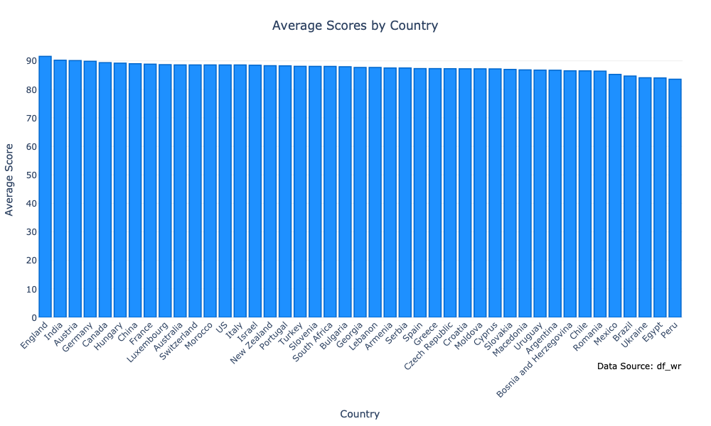
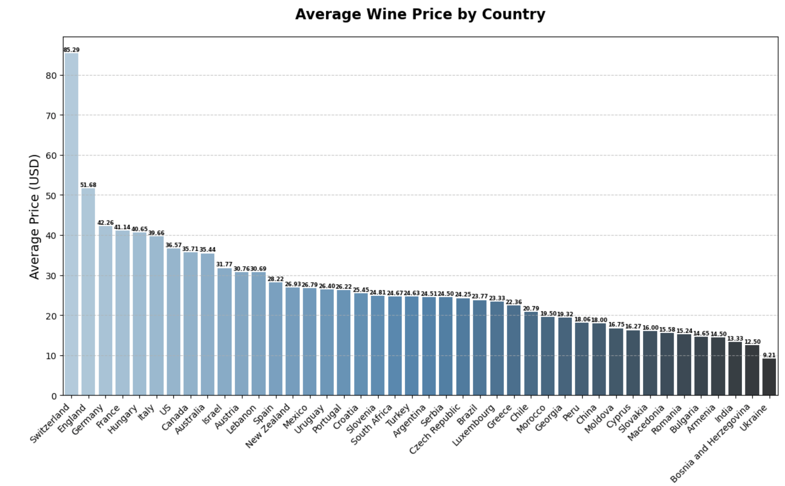
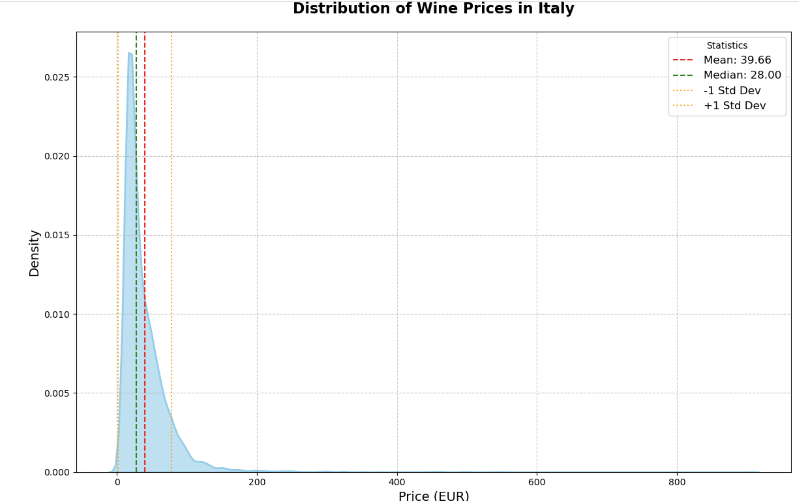
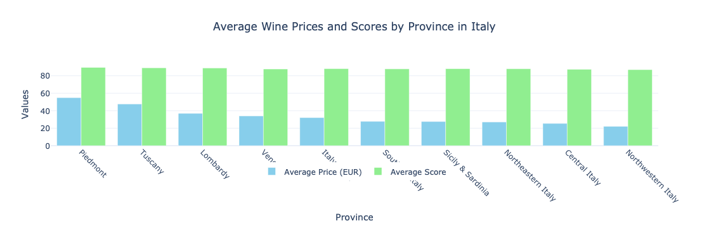
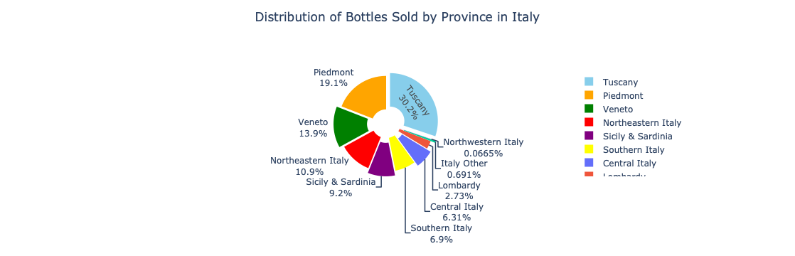
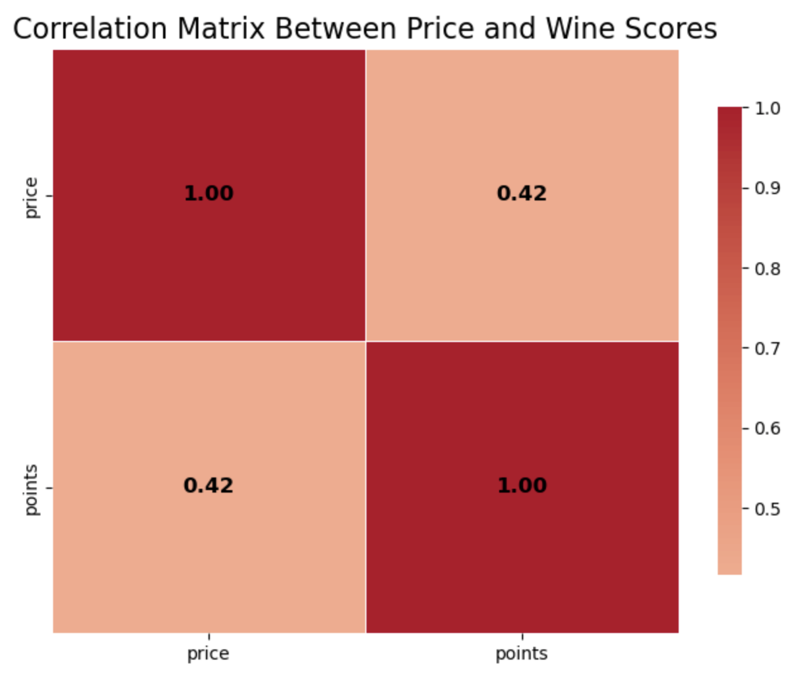
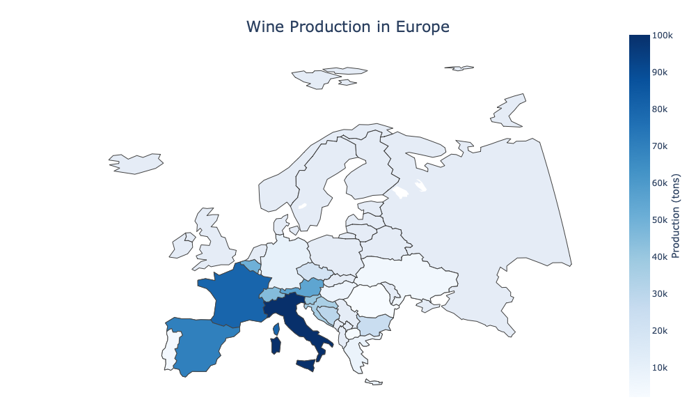

# Wine Marketplace Analysis: Price, Quality & Consumer Trends

## Executive Summary

Building a successful wine marketplace requires understanding what drives consumer value and how wine quality, pricing, and regional reputation influence purchasing decisions. Using **Python**, I analyzed over **130,000 wine reviews** to uncover global wine trends and identify opportunities for connecting local producers with buyers worldwide.

By **cleaning, transforming, and visualizing** the data, I evaluated country-level performance, regional wine markets, and the relationship between price and quality. The analysis revealed that expensive wines are not always better, certain regions command premium prices due to reputation rather than quality differences, and consumers can find highly rated wines across multiple price points.

### Key Business Impact

* Analyzed **130,000 wine reviews** from producers worldwide
* Identified premium and value-driven wine regions
* Measured the relationship between price and quality (**correlation = 0.42**)
* Revealed opportunities for marketplace segmentation across different customer budgets
* Generated insights to support product positioning and seller acquisition strategies

---

## Business Problem

A global wine marketplace aims to connect small local producers with buyers around the world. To build an effective platform, it is important to understand:

* Which countries and regions produce the highest-rated wines
* Whether higher prices actually indicate better quality
* Which wine-producing regions offer the best value
* How regional reputation impacts pricing
* What insights can improve marketplace positioning and product recommendations

The goal of this project was to use wine review data to uncover market trends and identify opportunities for creating a curated marketplace that serves both premium and budget-conscious consumers.

---

## Methodology

### Data Preparation

* Cleaned and standardized a dataset containing over 130,000 wine reviews
* Created separate datasets for country-level and province-level analysis
* Handled missing values and standardized location information

### Analysis

Used Python to analyze:

* Average wine scores by country
* Average wine prices by country
* Italian regional wine performance
* Wine price distributions
* Sales concentration by province
* Correlation between price and quality
* European wine production patterns

### Visualization

Created visualizations to cto explore wine ratings, pricing trends, regional performance, and production patterns across Europe.

#### 1. Average Score by Country

#### 2. Average Wine Price by Country

#### 3. Distribution of Italian Wine Prices

#### 4. Average Wine Prices and Scores by Province in Italy

#### 5. Distribution of Bottles Sold by Province in Italy

#### 6. Correlation Between Price and Wine Scores in Italy

#### 7. Wine Production in Europe

These visualizations highlight:
- Country-level wine score comparisons
- Average wine prices across countries
- Italian wine price distribution and variability
- Regional performance benchmarking in Italy
- Sales distribution by province
- Correlation between price and wine ratings
- Geographic wine production patterns across Europe

---

## Skills

**Python:** Pandas, NumPy, Data Cleaning, Data Transformation, Exploratory Data Analysis (EDA)

**Data Visualization:** Matplotlib, Seaborn, Plotly, Geographic Mapping

**Data Analysis:** Descriptive Statistics, Correlation Analysis, Market Segmentation, Consumer Behavior Analysis, Regional Benchmarking

---

## Results & Business Recommendations

The analysis revealed several important trends within the global wine industry.

### Global Wine Performance

* All analyzed countries achieved average wine ratings above 80 points, demonstrating consistently high global wine quality.
* Switzerland recorded the highest average wine prices, while countries such as Italy, France, and Portugal offered stronger value relative to quality.

### Italian Market Insights

* The average Italian wine price was €39.66, while the median price was only €28, indicating a market influenced by premium luxury products.
* Piedmont and Tuscany command the highest prices nationwide.
* Despite significant price differences, most Italian provinces maintain average ratings close to 90 points.

### Price vs Quality

* The correlation between price and quality was 0.42, indicating only a moderate relationship.
* Higher-priced wines are not necessarily better wines.
* Consumers can find excellent products across a wide range of price points.

### Marketplace Opportunities

* Tuscany accounts for approximately 30% of bottles sold, confirming its strong international brand recognition.
* Southern Italian regions and Sicily provide opportunities to promote high-quality wines at more accessible prices.
* Marketplace recommendations should prioritize quality-to-price value rather than price alone.

### Recommendations

Based on the findings, I would recommend:

* Building recommendation systems based on quality-to-price value rather than premium pricing alone.
* Highlighting high-performing but less recognized regions (e.g., Southern Italy and Sicily) to increase product diversity and offer customers better value.
* Creating customer segments based on spending behavior, allowing the marketplace to recommend wines for budget-conscious, mid-range, and premium buyers.
* Promoting smaller local producers whose wines receive strong ratings but lack international visibility.
* Using regional reputation, review scores, and pricing together to improve product discovery and search rankings.
* Developing curated collections such as "Best Value Wines", "Hidden Gems", and "Top Rated Under €20" to help customers navigate the catalog more effectively.

These strategies would help the marketplace differentiate itself from competitors, improve customer satisfaction, and increase conversion by matching users with wines that fit both their preferences and budget.

---

## Next Steps

* Develop a value score metric combining quality, price, and popularity to support product recommendations.
* Expand the analysis to winery-level performance to identify potential producer partnerships.
* Analyze consumer purchasing behavior and conversion data to optimize marketplace merchandising and pricing strategies.

---

**The analysis shows that marketplace growth opportunities lie in promoting high-value wines rather than simply premium-priced products, allowing the platform to serve a broader customer base while supporting smaller producers.**

---

## Dataset  
- **Source:** [Wine Reviews Dataset](https://www.kaggle.com/datasets/zynicide/wine-reviews) (130,000 rows)  
- **Main Columns:** `country`, `province`, `variety`, `vineyard`, `price`, `points`, `description`

---

## Files in this Repository  
| File | Description |
|------|--------------|
| `Wine_Review_Data_Analysis.ipynb` | Main analysis in Python (data cleaning, exploration, visualization). |
| `Wine_Review_Marketplace_Presentation.pdf` | Project presentation and key takeaways. |
| `Visualizations` | Collection of 7 visualizations including country score comparisons, average wine prices, Italian wine price distribution, regional benchmarking, sales distribution by province, price–score correlation analysis, and European wine production maps.  |
| `README.md` | Project overview, context, and insights. |
